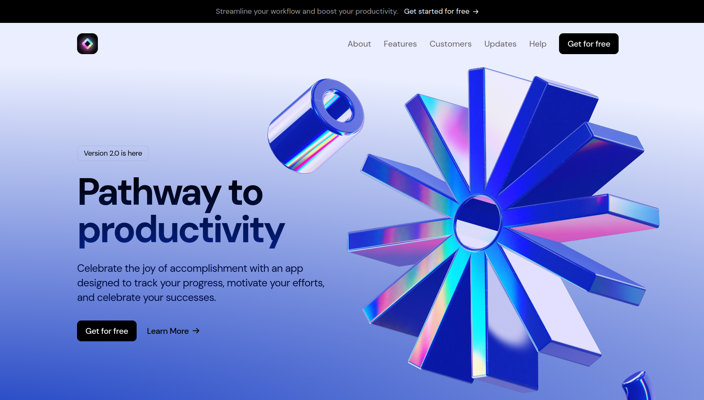

# Saas Landing Page

[LIVE DEMO](https://saas-landingpage-dngtnv.netlify.app/)



Design adapted from 'SaaS Website UI Kit — Framer Website Kit' by Framer: [here](https://www.figma.com/community/file/1347551304372055519/saas-website-ui-kit-framer-website-kit).

## Getting Started

```bash
npm install

cd saas-landing-page

npm run dev
```

## Tech Stack

- **Next.js**: - A React framework with hybrid static & server rendering, and route pre-fetching, etc.
- **TailwindCSS**: A utility-first CSS framework packed to build fast and responsive designs.
- **Framer Motion**: A library to create animations and gestures.
